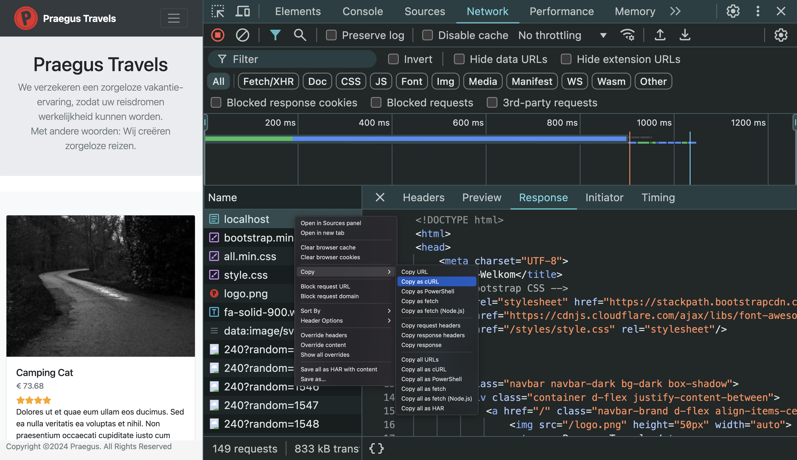
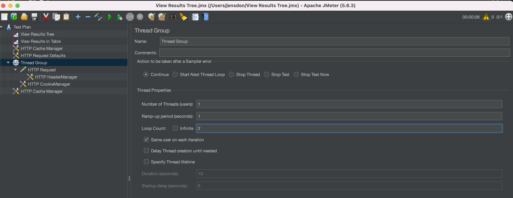

# Opdrachten

Hierbij de opdrachten bijpassend bij de workshop.

## Opdracht 1 - JMeter installeren

1. Download de zip https://dlcdn.apache.org//jmeter/binaries/apache-jmeter-5.6.3.zip
2. Pak deze uit en open Jmeter via de jmeterw.cmd file in de bin folder.
3. Ga in je Google Chrome browser naar Praegus Travels en kopieer het request:

4. Ga in het JMeter menu naar Tools > Import from cURL.
5. Plak de inhoud in het venster en klik op Create testplan.
6. Druk op de groene playknop in de browser en start de test.
7. Open de results tree en kijk wat er gebeurt.

## Opdracht 2 - Scenario

Laten we samen is nadenken over een goed loadtest scenario voor Preagus Travels. Hou daarbij in stand dat we een zo realistisch mogelijke test willen. We houden even in het achterhoofd dat we zo waarheidsgetrouw een eindgebruiker willen nabootsen.

## Opdracht 3 - Implementeer het scenario

## Opdracht 4 - Caching

Een belangrijk onderdeel is caching. Dit moeten we nog toevoegen in onze test. Stel je threadgroup als volgt in:

1. Klik met de rechtermuisknop op het testplan in JMeter en kies voor Add > Config Element > HTTP Request Defaults
2. Open in de HTTP Request Defaults het tabje advanced en klik de optie Retrieve Embedded Resources aan.
3. Draai nogmaals de test en kijk in de results tree wat er veranderd is.
4. Voeg nu de Cache Manager toe Add > Config Element > HTTP Cache Manager
5. Draai nogmaals de test en probeer uit te zoeken wat er veranderd is.

## Opdracht 5 - Assertions

1. Klik met je rechtermuisknop op het testplan en kijk onder Add > Assertions wat je handig lijkt om toe te voegen.
2. Voeg deze assertions toe aan je test
3. Stel express foute waardes in en kijk of je assertions werken.

## Opdracht 6 - JMeter plugins

1. Voor betere rapportage hebben we wat plugins nodig. Ga naar https://jmeter-plugins.org/wiki/PluginsManager/#Installation-and-Usage en installeer de Plugin Manager
2. Installeer de plugin Custom Thread Groups
3. Ga naar Add > Threads (Users) > jp@gc - Ultimate Thread Group en voeg deze toe.
4. Voeg nu alle requesten toe onder deze groep.
5. Maak een mooi loadmodel.

## Opdracht 7 - JMeter Non Gui

JMeter gebruikt veel memory via de GUI. Probeer je script is te draaien zonder GUI

`jmeter -n -t my_test_plan.jmx -l log.jtl`
