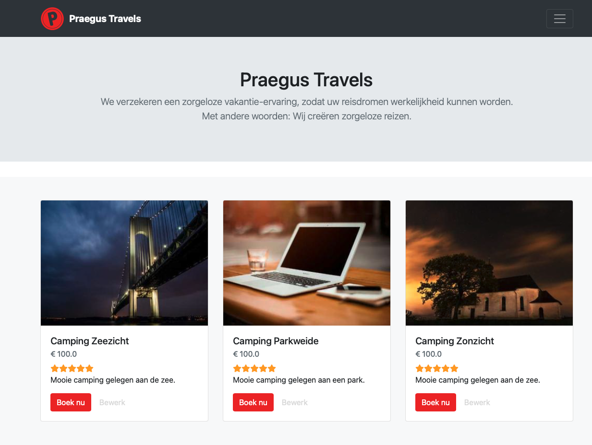
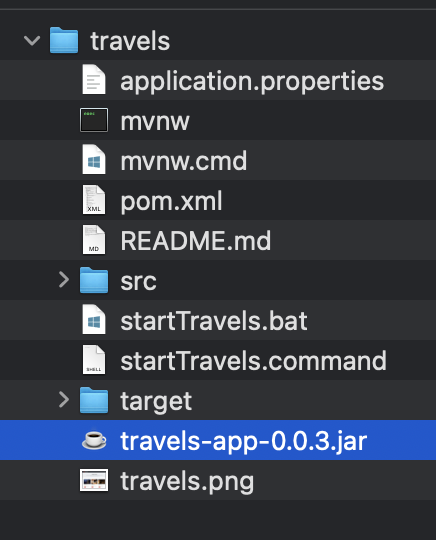

# Praegus Travels

Dit is een demo applicatie geschikt voor trainingsdoeleinden.

## Wat heb je nodig?

1. Om Praegus Travels te installeren heb je een Java JRE nodig. Deze kun je [hier](https://www.java.com/nl/download/manual.jsp) downloaden. Vaak heb je deze al geinstalleerd en kan je deze stap dus overslaan.
2. Clone deze repository, een [zip downloaden](https://github.com/praegus/travels/archive/refs/heads/main.zip) van dit project kan ook. Pak de zip daarna uit.
3. Download [hier](https://repo1.maven.org/maven2/nl/praegus/travels-app/0.0.3/travels-app-0.0.3.jar) de laatste versie van Praegus Travels
4. Plaats het jar bestand in je project folder:

## Hoe start ik Praegus Travels?

1. Open het bestand startTravels.bat (Windows) of startTravels.command (MacOS)
2. Ga nu in je browser naar [http://localhost:1237](http://localhost:1237), fijne vakantie!

| Gebruikersnaam | Wachtwoord |
| :------------: | :--------: |
|     admin      |   admin    |

## Cypress

1. [Download](https://download.cypress.io/desktop) Cypress en pak de zip uit
2. Start Cypress
3. Kies een folder voor je project
4. Maak de keuze voor e2e testing en kies voor continue. Cypress maakt wat nu automatisch wat bestanden aan in je project folder.
5. Kies daarna voor Google Chrome als browser
6. Maak een nieuwe spec en run het voorbeeld met https://example.cypress.io/

## Bruno
1. [Download](https://www.usebruno.com) Bruno en installeer deze.
