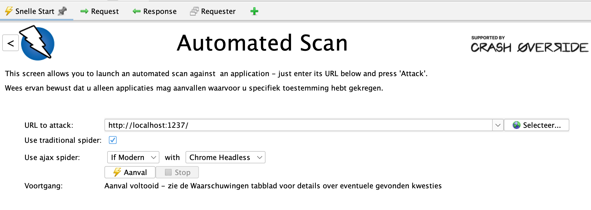

# Opdrachten

Hierbij de opdrachten bijpassend bij de workshop security testen.

## Installeren

1. Ga naar https://www.zaproxy.org/download/.
2. Download de installer.
3. Installeer ZAP op je machine.
4. Start de ZAP scan op en geef de URL op van Preagus Travels:

5. Klik nu op aanval en wacht tot de scan klaar is.
6. Ga in de browser naar Praegus Travels en kijk wat er veranderd is.
7. Kijk in het tabje waarschuwingen naar alle meldingen en bestudeer de uitkomsten.
8. BONUS: Probeer de ZAP scan te draaien van de CLI zodat je deze ook eventueel kan integreren in je pipeline. Kijk voor meer details op https://www.zaproxy.org/docs/desktop/cmdline/
9. BONUS: Probeer de Juiceshop https://juice-shop.herokuapp.com voor nog meer vulnerabilities.
